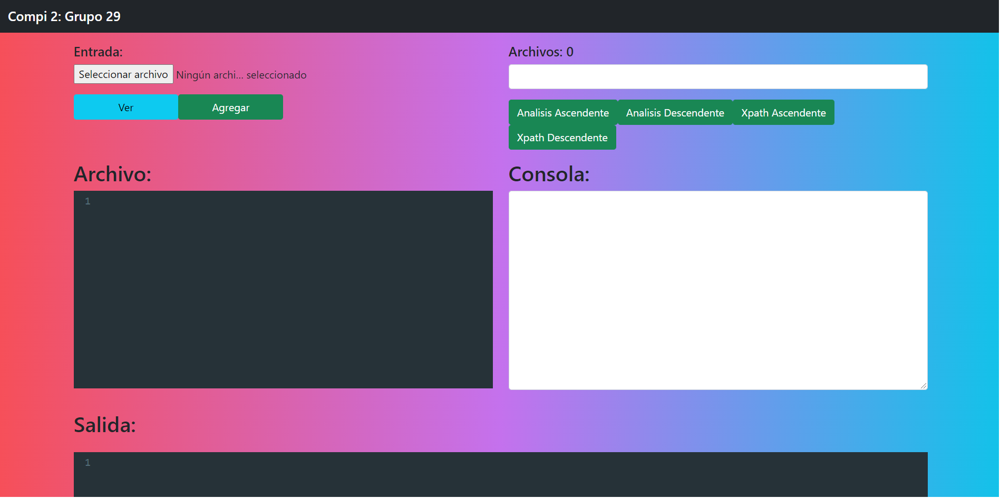
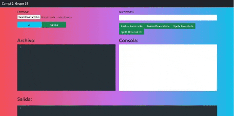
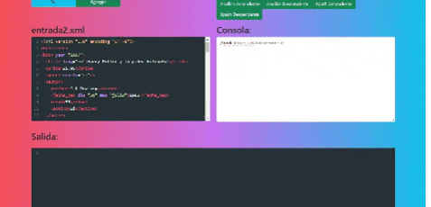
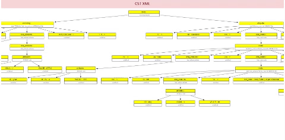

# Manual de usuario
---

## TytusX 

Es un administrador de bases de datos documental de código abierto desarrollado bajo licencia MIT que utiliza lenguaje JavaScript para su análisis. 
Soporta archivos XML y maneja el lenguaje de consultas XPath.

---

### Aplicación

Para poder interacctuar con la aplicación, visite el siguiente link:
[TytusX Grupo 29](https://tytusdb.github.io/tytusx/20211SVAC/G29/)

---

### Funcionamiento de la aplicación

* **Agregar archivo xml**
  &nbsp;
  1. Seleccionar archivo formato xml.
  2. Dar click en boton de *agregar*. Si desea ver el archivo antes de agregarlo puede dar click en boton *ver*.
  &nbsp;
  

* **Seleccionar archivo xml**
  &nbsp;
  1. Dar click en la *lista de archivos*, esquina superior derecha.
  2. Seleccionar archivo xml que desea utilizar.
  &nbsp;
  
  
* **Ejecutar análisis**
  &nbsp;
  1. Dar click en *Análisis ascendente* o *Análisis descendente* según lo desee, al finalizar el análisis se le mostrara una alerta con la confirmación.
  2. Dar click en *Xpath ascendente* o *Xpath descendente* según lo desee, al finalizar el análisis se le mostrar una alerta con la confirmación.
  3. Al realizar la consulta se mostrará el resultado de esta en el *recuadro de salida*.
  &nbsp;
  

* **Vista de reportes**
Al haber realizado los análisis correspondientes, puede visualizar una serie de reportes, los cuales se encuentran despues del recuedro de salida.
  &nbsp;
  **1. Árbol ast xml:** Dar click en *AST XML*, le abrirá una nueva pestaña con el gráfico.
  **2. Árbol cst xml:** Dar click en *CST XML*, le abrirá una nueva pestaña con el gráfico.
  **3. Árbol ast xpath:** Dar click en *AST XPATH*, le abrirá una nueva pestaña con el gráfico.
  **4. Árbol cst xpath:** Dar click en *CST XPATH*, le abrirá una nueva pestaña con el gráfico.
  **5. Tabla de simbolos:** Dar click en *Tabla de Simbolos*, le abrirá una ventana emergente con una tabla, donde se muestran los datos del archivo xml.
  **6. Reporte de errores:** Dar click en *Reporte de Errores*, le abrirá una ventana emergente con una tabla, donde se muestran los errores encontrados durante el análisis.
  **7. Reporte gramatical:** Dar click en *Reporte Gramatical*, le abrirá una ventana emergente con una tabla, donde se muestran las producciones y acciones semánticas que se realizaron en el análisi del archivo xml.
  **8. Reporte gramatical xpath:** Dar click en *Reporte Gramatical Xpath*, le abrira una ventana emergente con una tabla, donde se muestran las producciones y acciones semánticas que se realizaron en el análisis de la consulta.
  &nbsp;
  

